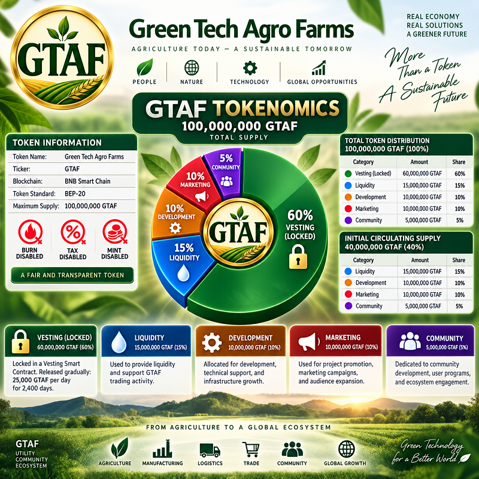

# 📊 GTAF Tokenomics

## Token Information

**Token Name:** Green Tech Agro Farms  
**Ticker:** GTAF  
**Blockchain:** BNB Smart Chain  
**Token Standard:** BEP-20  
**Maximum Supply:** 100,000,000 GTAF  

❌ **Burn Disabled**  
❌ **Tax Disabled**  
❌ **Mint Disabled**

---

# 📈 Token Distribution

## Total Supply — 100,000,000 GTAF (100%)

| Category | Amount | Share |
|---|---:|---:|
| 🔒 Vesting (Locked) | 60,000,000 GTAF | 60% |
| 💧 Liquidity | 15,000,000 GTAF | 15% |
| 🛠️ Development | 10,000,000 GTAF | 10% |
| 📢 Marketing | 10,000,000 GTAF | 10% |
| 🌍 Community | 5,000,000 GTAF | 5% |

---

# 🚀 Initial Circulating Supply — 40,000,000 GTAF (40%)

The initial circulating supply consists of:

| Category | Amount | Share |
|---|---:|---:|
| 💧 Liquidity | 15,000,000 GTAF | 15% |
| 🛠️ Development | 10,000,000 GTAF | 10% |
| 📢 Marketing | 10,000,000 GTAF | 10% |
| 🌍 Community | 5,000,000 GTAF | 5% |

---

## 💧 Liquidity — 15,000,000 GTAF (15%)

Used to provide liquidity and support GTAF trading activity.

## 🛠️ Development — 10,000,000 GTAF (10%)

Allocated for development, technical support, and infrastructure growth.

## 📢 Marketing — 10,000,000 GTAF (10%)

Used for project promotion, marketing campaigns, and audience expansion.

## 🌍 Community — 5,000,000 GTAF (5%)

Dedicated to community development, user programs, and ecosystem engagement.

---

# 🔒 Vesting — 60,000,000 GTAF (60%)

**Locked Vesting Allocation**

60% of the total GTAF supply is allocated to the Vesting mechanism and is not intended to enter free circulation at once.

Tokens are released gradually according to the established schedule:

**25,000 GTAF per day**

**Distribution Period: 2,400 days**

The Vesting mechanism supports the long-term development of the GTAF ecosystem and may support strategic areas including:

- 👥 Team
- 🤝 Investors
- 🌱 Ecosystem Development
- 📢 Marketing & Partnerships
- 🌍 Community Growth
- 🏦 Strategic Reserve

The Vesting mechanism is designed to support controlled token distribution and the long-term development of the GTAF ecosystem.

---

## 📌 Total Supply

**100,000,000 GTAF**
